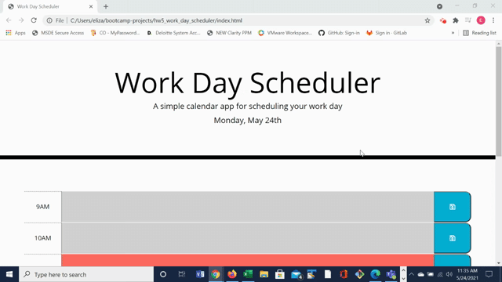

# Work Day Scheduler

## Deployed Application
https://emangano2816.github.io/hw5_work_day_scheduler/

## Description
When the application is opened, the current date is displayed at the top.  As the user scrolls down, the user will see that each timeblock is color coded as past (grey), present (red), and future (green).  The user is able to create an event for any given timeblock by clicking into the text area and including text.  Clicking the blue save button saves the user's text (i.e., event) into local storage. If the user refreshes the page or revisits the application in the same day, the events that were saved persist on the page.  When the user opens the application on a new day, the timeblock events reset.

## Technologies Used
1. HTML
2. CSS (custom, bootstrap)
3. Javascript
4. jQuery
5. Moment.js

## Application Functionality

## Contact Information
emangano2816@gmail.com
